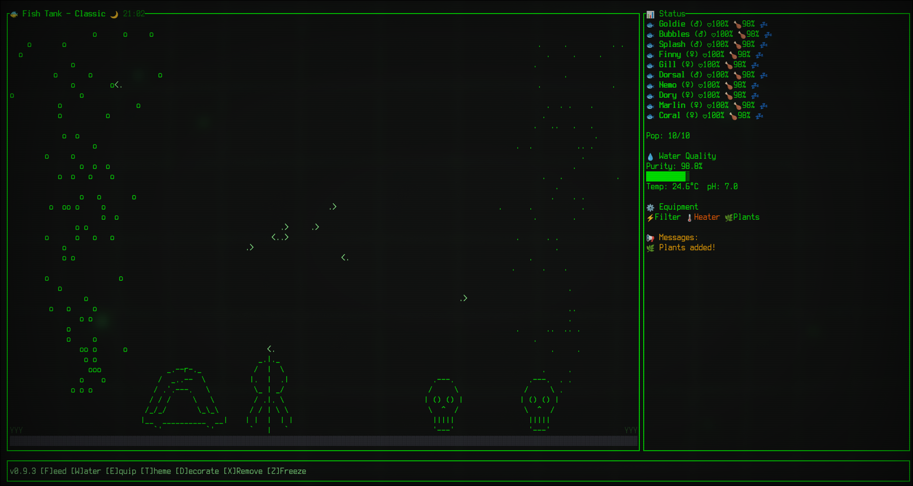

# 🐟 Fishtank TUI

A retro-styled terminal user interface (TUI) aquarium simulator built in Rust. Your very own Tamagotchi-style fish that lives in your terminal!




## ✨ Features

- 🐠 **8 Unique Fish Species** - Goldfish, Betta, Guppy, Neon Tetra, Angelfish, Clownfish, Koi, Pufferfish!
- � **Decorations** - Customize your tank with high-quality ASCII Castles, Plants, and Rocks.
- 🫧 **Particle Effects** - Dynamic bubble streams and floating particles.
- �🌙 **Day/Night Cycle** - Tank dims at night, fish sleep (1 real sec = 3 game sec).
- 💧 **Water Quality System** - Manage Purity, pH, and Temperature.
- ⚙️ **Equipment** - Install filters & heaters to automate tank maintenance.
- 🧬 **Breeding System** - Watch fish multiply! (If happy & healthy).
- ❄️ **Weekend Freeze Mode** - Pause time when you're busy.
- 🎨 **Themes** - 5 visual styles (Ocean, Matrix, Retro, Zen, etc.).
- 💾 **Auto-Save & Offline Progress** - Your fish live while you're away.

## 🎮 Gameplay

### 🐟 The Fish
- **Needs**: Hunger 🍽️, Happiness 😊, Health ❤️, Energy ⚡.
- **Lifespan**: Fish grow from Fry -> Juvenile -> Adult.
- **Breeding**: Adults of same species can have babies if space allows (Max 10 fish).

### � The Living Tank
- **Decorations**: Press `D` to add items. Press `X` to remove them.
- **Bubbles**: Install a **Filter** (`E`) to see bubbles rise!
- **Collision**: Items won't overlap, ensuring a clean look.

### 🌙 Time Cycle
- **Day (06:00 - 18:00):** Active fish, bright tank.
- **Night (18:00 - 06:00):** Fish sleep (drift slowly), dim blue light.

## 🎯 Controls

| Key | Action |
|-----|--------|
| `N` | **New Fish** (Cycle species 0-7) |
| `F` | **Feed** all fish |
| `W` | **Water Change** (Clean tank) |
| `E` | **Equipment** Shop (Filter/Heater) |
| `D` | **Decorate** (Add random item) |
| `X` | **Remove Decoration** (Undo last) |
| `Shift+X` | **Clear All Decorations** |
| `T` | **Theme** Switcher |
| `Z` | **Freeze/Unfreeze** (Pause game) |
| `R` | **Restart** (Wipe save) |
| `Q` | **Quit** (Auto-save) |

## 🐟 Fish Species

| Species | Sprite | Traits |
|---------|--------|--------|
| 🟡 **Goldfish** | `><>` | Balanced classic. |
| 🔵 **Betta** | `>∫>` | Flowing fins, solitary. |
| 🟢 **Guppy** | `>°>` | Fast & cheerful. |
| 🔴 **Neon Tetra** | `>->` | Small, schools well. |
| ⚪ **Angelfish** | `>^>` | Shape vertical, graceful. |
| 🟠 **Clownfish** | `>||>` | Striped, likes anemones. |
| 🎏 **Koi** | `>==>` | Large, long-lived. |
| 🐡 **Pufferfish** | `(o)>` | Spiky & round! |

## � Installation

### Requirements

- Rust 1.70+ ([Install Rust](https://rustup.rs/))
- A terminal (Linux, macOS, Windows)

### Quick Install

```bash
git clone https://github.com/yourusername/fishtank-TUI.git
cd fishtank-TUI
./install.sh
```

The binary will be installed to `~/.local/bin/fishtank`.

Make sure `~/.local/bin` is in your PATH:
```bash
export PATH="$HOME/.local/bin:$PATH"
```

### Manual Build

```bash
cargo build --release
./target/release/fishtank
```

## 🚀 Roadmap

- [x] Multiple fish species & Breeding
- [x] Decorations & Particles (Living Tank Update)
- [x] Water quality & Equipment
- [ ] **Algae System**: Green growth on walls needing cleaning.
- [ ] **Economy**: Earn money to buy fancy items.
- [ ] **Mini-games**: Catch food, race fish.

## 🛠️ Development

```bash
# Run in debug mode
cargo run

# Run tests
cargo test

# Check code
cargo clippy
```

## 📄 License

MIT License - see [LICENSE](LICENSE) file

## 🤝 Contributing

Contributions welcome! This project is designed to be beginner-friendly.

## 🐛 Troubleshooting

**Terminal too small?**
- Minimum recommended size: 80x24
- Resize your terminal window

**Fish died immediately?**
- This might happen if you were away for a very long time
- Press `N` to add a new fish

**Can't find the binary after install?**
- Make sure `~/.local/bin` is in your PATH
- Try running: `~/.local/bin/fishtank` directly

## ❤️ Credits

Created with love for retro terminal aesthetics and virtual pet nostalgia.

Built with:
- [Ratatui](https://github.com/ratatui-org/ratatui) - Amazing TUI framework
- [Crossterm](https://github.com/crossterm-rs/crossterm) - Cross-platform terminal manipulation

---

**Start your virtual aquarium journey today! 🐠✨**
